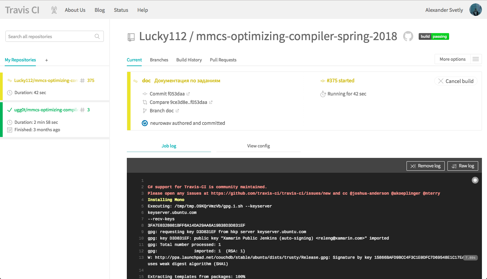
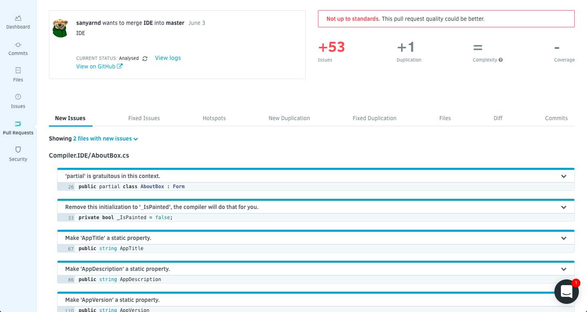

### Название задачи
Настроить CI, авторевью кода и тесты

#### Постановка задачи
С помощью облачных сервисов:
- настроить прекоммит хуки на проверку оформления кода по заданным параметрам
- настроить прекоммит хуки на сборку проекта с указанной конфигурацией
- выбрать библиотеку для тестов

#### Зависимости задач в графе задач
Отсутствуют

#### Теоретическая часть задачи
Прекоммит хуки не позволяют позволяют принять, например, пулл реквест, пока не выполнены некоторые условия.  
Для удаленной сборки проекта был выбран сервис Travis-CI, так как в нем есть поддержка C#. Для анализа code climate был выбран сервис Codacy.

#### Практическая часть задачи (реализация)
Привер конфигурации для сборки проекта
```
language: csharp
solution: Compiler.Parser.sln
mono:
  - latest
script:
  - xbuild /p:Configuration=WithoutIDE Compiler.Parser.sln
```

#### Пример работы.
- Окно мониторинга сборки проекта<br/><br/><br/><br/>
- Окно мониторинга code climate проекта. Пример с анализом пулл реквеста<br/><br/><br/><br/>