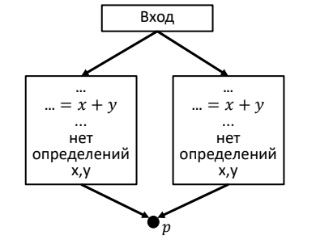

### Название задачи

Поиск множеств `E_GEN` и `E_KILL` для базового блока

#### Постановка задачи

Реализовать алгоритм поиска множеств `E_GEN` и `E_KILL` по базовому блоку

#### Зависимости задач в графе задач

* Базовые блоки
* Трехадресный код
* Реализация итеративного алгоритма для достигающих выражений

#### Теоретическая часть задачи

Множество `E_GEN` -- это такое множество, которое содержит все выржения сгенерированные базовым блоком `B`. Причем переменные из выражений не переопределяются до конца блока.

Множество `E_KILL` -- это такое множество, которое содержит все выражения из программы уничтожаемые базовым блоком `B`

Блок генерирует выражение `x + y`, если он вычисляет `x + y` и потом не переопределяет `x` и `y`

Блок уничтожает выражение `x + y`, если он присваивает `x` или `y` и потом не перевычисляет `x + y`

#### Практическая часть задачи (реализация)

* Был релизован класс `TransferFunction`, который в свою очередь унаследован от интерфейса `ITransferFunction`
* Был релизован метод `GetEGenEKill` для поиска множеств `e_gen` и `e_kill`
* Был реализован метод `Transfer`, который по переданному ему базовому блоку и входному множеству `IN` находит множества `e_gen`, `e_kill` и применяет передаточную функцию для вычисления множества `OUT`.

<br/><br/>Передаточная функция<br/><br/>


<br/><br/>

Алгоритм состоит из двух этапов. На первом этапе происходит поиск множества `e_gen` для базового блока

```algorithm
	node_index = 0
	foreach node in basicBlock.Nodes:
		if (node is expression as expr):
			redefinition = false
			for next_node in basicBlock.Skip(node_index+1):
				if (next_node is Assign as ass):
					if (ass.Left is Var as lv) && (lv.Id == ass.Result.Id):
						redefinition = true
					if (ass.Right is Var as rv) && (rv.Id == ass.Result.Id):
						redefinition = true
			if !redefinition:
				e_gen.Add(expr.Label)
		node_index++
```

На втором этапе происходит поиск множества `e_kill`.
*	Сначала находим список всех выражений-присвоений базового блока(не обязательно только `x + y`). 
*	Далее, из всех выражений-присвоений(вида `x + y`) трёхадресного кода исключаем выражения-присвоения базового блока. 
*	Находим метки выражений-присвоений базового блока.
*	Ищем множество `e_kill` для всех выражений-присвоений текущего базового блока

```algorithm
	foreach node in basicBlock.Nodes:
		if node is Assign as ass:
			basicBlockAssignNodes.Add(ass)

	exceptedAssignNodes = AllAssignNodes.Except(basecBlockAssigns)
	marksBasicBlockAssignNodes = basicBlockAssignNodes.Select(ass_node => ass_node.Result.Id)
	
	foreach ean in exceptedAssignNodes:
		contains = false
		if (ean.Left is Var as lv) && marksBasicBlockAssignNodes.contains(lv.Id):
			contains = true
		if (!contains) && (ean.Right is Var as rv) && marksBasicBlockAssignNodes.contains(rv.Id):
			contains = true
		if contains:
			e_kill.Add(ean.Label)
```

Метод `Transfer`

```algorithm
	def Transfer(basicBlock, IN):
		(e_gen, e_kill) = GetEGenEKill(basicBlock)
		outset = Union(IN \ e_kill, e_gen)
```

<!-- #### Тесты
TODO

#### Пример работы
TODO -->