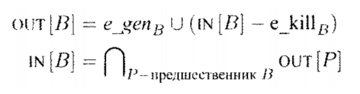

### Название задачи

Итерационный алгоритм для достигающих выражений

#### Постановка задачи

Реализовать алгоритм поиска `IN/OUT` множеств для всех базовых блоков программы.

#### Зависимости задач в графе задач

* Базовые блоки
* Трехадресный код
* Граф потока управления
* Поиск множеств `E_GEN` и `E_KILL`
* Оптимизации доступных выражений

#### Теоретическая часть задачи

Выражение вида `x + y` доступно в точке `p`, если любой путь от входа к p вычисляет `x + y` и после последнего вычисления до достижения `p` нет присваиваний `x и y`.
Оператор сбора -- операция над множествами. Для алгоритма достигающих выражений оператор сбора это пересечение.
`U` -- универсальное множество. 
Универсальное множество -- множество, содержащее все выражения-присвоения вида `x + y` программы.
В отличие от алгоритма о достигающих определениях в алгоритме достигающих выражений осуществляется прямой проход(сверху вниз), а не обратный.

<br/><br/>Доступные выражения<br/><br/>


<br/><br/>

Смысл алгоритма поиска достигающих выражений в том, чтобы найти достигающие выржения на входе(IN) и на выходе(OUT) базового блока для всех базовых блоков в программе

#### Практическая часть задачи (реализация)

* Был релизован класс `IterativeAlgorithm`, который в свою очередь унаследован от интерфейса `IAlgorithm`
* Был релизован метод `Analyze`, который по переданному ему графу потоку управления, оператора сбора и передаточной функции находит `IN/OUT` множества для всех базовых блоков
* Так же был реализован класс `Operations`, который унаследован от интерфейса `ILatticeOperations`. Класс `Operations` инкапсулирует нахождение верхней границы полурешётки(универсального множества выражений-присвоений трёхадресного кода) и метод `Operator`, который реализует оператор сбора.

Псевдокод алгоритма.

```algorithm
	def Analyze(CFG, op, tf)
		IN[B0] = {}
		OUT[B0] = tf.Transfer(B0, IN[B0], op)
		
		foreach block in CFG.Blocks.Skip(1):
			IN[block] = {}
			OUT[block] = U
		
		changed = true
		while changed:
			changed = false
			foreach block in CFG.Blocks.Skip(1):
				IN[block] = op(block.Parents)
				OUT[block] = tf.Transfer(block, IN[block], op)
				
				if OUT[block] \ OUT_prev[block] != {} :
					changed = true
					data[block] = (IN[block], OUT[block])
```

<!-- #### Тесты
TODO

#### Пример работы
TODO -->