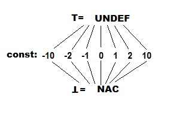
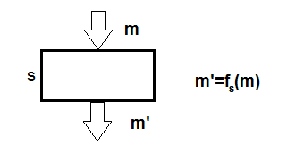

### Название задачи

Базовые структуры и итерационный алгоритм для распросранения констант

#### Постановка задачи

Реализовать структуры для задачи распространения констант и применить итерационный алгоритм

#### Зависимости задач в графе задач

* Интерфейс передаточной функции
* Передаточная функция и генерация множеств gen и kill
* Стурктура базовых блоков

#### Теоретическая часть задачи
Введем полурешетку вида:



Каждая переменная в некоторой таблице имеет одно из значений в полурешетке - *UNDEF* (undefigned), *const*, *NAC* (not a const). Таблица является декартовым произведением полурешеток, и следовательно, сама полурешетка.
Таким образом, элементом данных будет отображение *m* на соответствующее значение полурешетки.

Опишем предаточную функцию:



1. Если s не является присваиванием, то f тождественна, т.е. m = m'
2. Если s присваивание, то для каждого v != x: m'(v) = m(v)
3. Если s присваивание константе, то m'(x) = const
4. Если s: x = y + z, то
    * m'(x) = m(y) + m(z), если m(y) и m(z) - const 
    * m'(x) = NAC, если m(y) или m(z) - NAC
    * m'(x) = UNDEF в остальных случаях

Функция монотонна, потому итерационный процесс решает поставленную задачу. 

#### Практическая часть задачи (реализация)

Необходимо описать операции, передаточную функцию и итерационный алгоритм. Для этого предварительно был реализован класс *VarValue*, который хранит тип переменных (*UNDEF*, *const*, *NAC*), их значения если это константа, и операции над ними.

```csharp
 public class VarValue
    {
        public enum Type { UNDEF, CONST, NAC };

        public Type varType; // Операнд определяющий тип переменной
        public IntConst value; // Операнд со значением константы, если тип переменной CONST

        // Три вида конструктора для инициализации значений в различных ситуациях
        public VarValue()
        {
            varType = Type.UNDEF;
            value = null;
        }

        public VarValue(IntConst c)
        {
            varType = Type.CONST;
            value = c;
        }

        public VarValue(Var v)
        {
            varType = Type.NAC;
            value = null;
        }

        //реализация опреатора сбора
        public VarValue CollectionOperator(VarValue right)
        {
            if (right == null || this == right)
                return this;
            if (this.varType == Type.NAC || right.varType == Type.NAC)
                return new VarValue(new Var());
            if (this.varType == Type.CONST && right.varType == Type.CONST)
                return new VarValue(new Var());
            if (this.varType == Type.CONST)
                return this;
            return right;
        }

        // функция-обертка для применения операций над пременными
        public static VarValue UseOperation(VarValue left, VarValue right, OpCode code)
        {
            if (left.varType == Type.CONST && right.varType == Type.CONST)
                return new VarValue(ApplyOperation(left.value, right.value, code));
            return OperationUnderNotConst(left, right);
        }

        // применение операций над не константными значениями
        private static VarValue OperationUnderNotConst(VarValue left, VarValue right)
        {
            if (left.varType == Type.NAC || right.varType == Type.NAC)
                return new VarValue(new Var());
            if (left.varType == Type.UNDEF || right.varType == Type.UNDEF)
                return new VarValue();
            return null;
        }

        // применение операций над константами
        private static IntConst ApplyOperation(IntConst left, IntConst right, OpCode op)
        {
            switch (op)
            {
                case OpCode.Plus: return left + right;
                case OpCode.Minus: return left - right;
                case OpCode.Mul: return left * right;
                case OpCode.Div: return left / right;
                default: return left;
            }
        }

        // функция сравнения для перегрузки операторов сравнения
        public override bool Equals(object obj)
        {
            if (ReferenceEquals(null, obj)) return false;
            if (ReferenceEquals(this, obj)) return true;
            if (obj.GetType() != this.GetType()) return false;
            if (varType == ((VarValue)obj).varType)
            {
                if (varType == Type.CONST && value != ((VarValue)obj).value)
                    return false;
                return true;
            }
            return false;
        }

        public static bool operator ==(VarValue left, VarValue right)
        {
            return Equals(left, right);
        }

        public static bool operator !=(VarValue left, VarValue right)
      ...
    }
```
Далее описываются классы *Operations*, *TransferFunction*, *IterativeAlgorithm*, которые реализуют интерфейс *ILatticeOperations*, *ITransferFunction* и *IAlgorithm* соответственно.

Класс *Operations* описывает структуру полурешетки: в качестве таблиц используется структура *Dictionary<Guid, VarValue>* ставящая в соответсвие каждой переменной ее состояние (текущий тип). В качестве нижней границы все значения словаря инициализируются как NAC, а в качестве верхней UNDEF. Так же реализован метод применения оператора сбора:

```csharp
		public Dictionary<Guid, VarValue> Operator(Dictionary<Guid, VarValue> a, Dictionary<Guid, VarValue> b)
		{
			var aCopy = a.ToDictionary(entry => entry.Key, entry => entry.Value);
			var bCopy = b.ToDictionary(entry => entry.Key, entry => entry.Value);
			Dictionary<Guid, VarValue> result = new Dictionary<Guid, VarValue>();
			foreach (var key in aCopy.Keys)
			{
				result[key] = a[key].CollectionOperator(b[key]);
				if (bCopy.ContainsKey(key))
					bCopy.Remove(key);
			}
			foreach (var key in bCopy.Keys)
				result.Add(key, bCopy[key]);
			return result;
		}
```

Класс *TransferFunction* непосредственно реализует функцию f описанную в теоретической части, *IterativeAlgorithm* описывается как и базовый, с учетом заданной структуры данных.